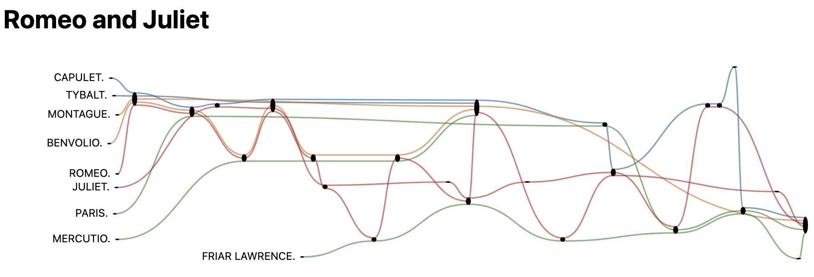

# NovelNarrativeCharts
Novel narrative charts using d3. Based on https://github.com/niskander/ComicBookNarrativeCharts.

Can process novels, plays, anything in raw text format. Will search for separators named "Chapter X," "Prologue," "Epilogue," etc. by default, but can be overridden.

The repo includes the Project Gutenberg text of Romeo and Juliet as a test case. The sample command below scans the text, breaking it up along scene lines, and detecting which characters are in each scene, which is then fed into the ComicBookNarrativeCharts visualization. This command uses four character groups to break the Montagues, Capulets, and general characters out from Romeo and Juliet, who are themselves in their own group:

```
./novel_narrative_charts.py \
    --book \
    --title="Romeo and Juliet" \
    --chapter_regex="SCENE \\w+\\." \
    --filename=sources/romeo_and_juliet.txt \
    --character_group=CAPULET.\|LADY\ CAPULET.,TYBALT. \
    --character_group=MONTAGUE.\|LADY\ MONTAGUE.,BENVOLIO. \
    --character_group=PARIS.,MERCUTIO.,FRIAR\ LAWRENCE. \
    --character_group=JULIET.,ROMEO.
```

Outputs are rendered locally in `novel_narrative_charts_output.html`:



Note that the character text lables can be dragged around to the user's liking.
